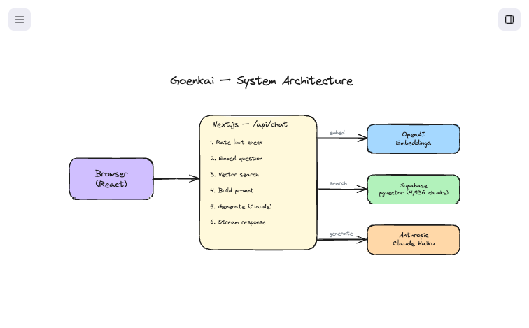

# Architecture

Goenkai is a Retrieval-Augmented Generation (RAG) chatbot. Rather than fine-tuning a model on Goenka's teachings, it retrieves relevant source material at query time and feeds it to a general-purpose LLM that generates a grounded response.

This document explains each component, why it was chosen, and where the trade-offs are.

## System overview

## Infrastructure

| Component | Service | Notes |
|---|---|---|
| Hosting | Vercel | Push to `main` = production deploy. Feature branches = preview URLs. |
| Database | Supabase | pgvector extension enabled. HNSW index on `chunks.embedding`. |
| LLM | Anthropic API | Claude Haiku. Streaming enabled. |
| Embeddings | OpenAI API | `text-embedding-3-small`. Used at both ingest and query time. |
| Rate limiting | In-memory | Per-server instance. Resets on restart. Sufficient for current scale. |

## Request flow

When a user sends a message, this is what happens in `/api/chat`:

1. **Rate limit** — Check hourly (50) and daily (200) request limits. In-memory tracking, per-server instance.

2. **Embed the question** — Send the user's question to OpenAI `text-embedding-3-small`, get back a 1,536-dimension vector. This is the same model used during ingestion, so the vector spaces are aligned.

3. **Vector search** — Call Supabase's `match_chunks` RPC function, which runs a cosine similarity search using pgvector's HNSW index. Returns the 8 most similar chunks with similarity > 0.3.

4. **Assemble the prompt** — Concatenate the retrieved chunks (with source metadata) into the system prompt, along with the voice/tone instructions and the full conversation history.

5. **Call Claude** — Send to Anthropic's Claude Haiku (`claude-haiku-4-5-20251001`) with `temperature: 0.7` and `max_tokens: 800` (see [why these values](#why-temperature-07-and-max_tokens-800) below). The response streams back as text chunks.

6. **Stream to browser** — The API returns a ReadableStream. A client-side ticker runs every 30ms, pulling 2 characters at a time from a buffer and rendering them at a steady pace (~66 characters/sec), each with a 150ms CSS fade-in. This decouples the API's bursty delivery from the calm, character-by-character display the user sees.

## Component choices and trade-offs

### Why RAG, not fine-tuning

Fine-tuning would bake Goenka's voice into the model weights. I chose RAG because:

- **Transparency** — I can see exactly which source chunks informed each response. With fine-tuning, the model's reasoning is opaque.
- **Iterability** — I can improve the knowledge base (add sources, fix chunking, re-embed) without retraining. Each change is testable in isolation.
- **Cost** — No training compute. Only inference costs.
- **Grounding** — RAG responses are anchored to specific passages. Fine-tuned models can hallucinate more confidently in the source's voice, which is worse than a generic hallucination.

The trade-off: RAG depends heavily on retrieval quality. If the right chunk isn't found, the response quality drops. This is why [chunk quality](data-corpus.md) and AI evals are the most important next steps.

### Why Claude Haiku (not Sonnet or Opus)

I also considered GPT-4o-mini (comparable tier from OpenAI) and the higher Claude tiers (Sonnet at 10x cost, Opus at 30x). Haiku is the right model for this use case:

- **Speed** — Chatbot responses need to feel fast. Haiku's time-to-first-token is significantly lower than Sonnet.
- **Cost** — At ~1/10th the price of Sonnet, Haiku makes this viable as a free product without aggressive rate limiting. Each request costs roughly $0.002 (embedding + LLM inference combined).
- **Sufficient quality** — The responses are grounded in retrieved context and shaped by a detailed system prompt. The model doesn't need to "know" Vipassana — it needs to follow instructions and synthesize provided text. Haiku does this well.

If AI evals reveal quality gaps that can't be solved through better retrieval or prompt engineering, upgrading to Sonnet is a one-line config change.

### Why temperature 0.7 and max_tokens 800

I chose `temperature: 0.7` because Goenka's teaching style has natural variation — the same concept is explained differently depending on context — but should never veer into speculation. 0.7 gives enough warmth and variability without losing control.

`max_tokens: 800` is a safety net, not a length control. The system prompt's formatting rules shape response length; the token ceiling just prevents runaway edge cases. This was originally set to 300, which caused responses to cut off mid-sentence — the fix and the lesson about instruction ordering are documented in [Prompt Engineering](prompt-engineering.md).

I'd want eval data comparing temperature 0.5, 0.7, and 0.9 before changing either value.

### Why OpenAI embeddings with an Anthropic LLM

Each provider's strength: OpenAI's `text-embedding-3-small` is well-benchmarked for semantic search at a low price point. Claude Haiku has superior instruction following for maintaining a consistent voice. There's no technical coupling between embedding and generation providers — they're independent API calls. Anthropic didn't offer embeddings when I made this choice, so the split was natural.

### Why Supabase pgvector (not Pinecone or Weaviate)

At 4,936 chunks, a dedicated vector database is overkill:

- **pgvector is fast enough** — HNSW indexing gives sub-50ms search at this scale. Pinecone's advantages (billion-scale, managed infrastructure) don't apply here.
- **One fewer service** — Supabase already provides the database. Adding pgvector is a single SQL migration, not a new vendor relationship.
- **Future-ready** — When I add user accounts and chat history, Supabase Auth and the same Postgres instance are ready.

The trade-off: if the knowledge base grows to 100K+ chunks, pgvector's performance may degrade and a dedicated vector DB would make sense. At current scale, it's not a concern.

### Why in-memory rate limiting (for now)

I chose in-memory rate limiting (50 requests/hour, 200/day) because this is a pre-production prototype with no real user traffic. The limits prevent a single actor from burning through API credits. The downside: on Vercel, each serverless function instance has its own memory, so the counter resets across deploys and doesn't persist between instances. For production, I'd move to database-backed per-user limits.

## What I'd change

- **Add observability** — No logging or monitoring currently. In production, I'd want to see: which questions are asked, which chunks are retrieved, response quality signals, latency percentiles.
- **Move rate limiting to the database** — The in-memory approach doesn't actually enforce limits reliably on Vercel's serverless architecture. A database-backed counter (using the existing Supabase instance) would persist across all requests and deploys.
- **Evaluate hybrid search** — Some queries are better served by exact keyword matching — for example, Pali terms like *anicca*, *sankhara*, or *vedana* that may not embed well semantically. Hybrid search would combine vector similarity with BM25 keyword matching so that a search for "anicca" finds every chunk containing that exact word, not just chunks about impermanence in general.
