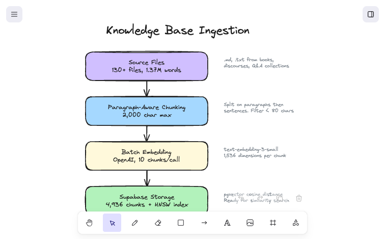

# Data Corpus

Goenkai's responses are only as good as the source material it retrieves from. This document covers how the corpus was curated, how it's chunked, and what the quality looks like.

## Why a custom knowledge base matters

Standard LLMs have limited exposure to Goenka's teachings. Most of his material exists in books, transcripts of 10-day course discourses (which aren't publicly distributed), Q&A sessions from specific Vipassana centers, and public talks that exist only as scattered web pages or YouTube transcripts. Ask ChatGPT about Goenka and you'll get a generic summary; ask it to explain his specific teaching on *vedana* (sensations) in the context of the second day's discourse and it has nothing to draw on.

The knowledge base gives Goenkai access to this material. Every response is grounded in specific passages, not the model's general knowledge of Buddhism.

## Corpus overview

| Metric | Value |
|---|---|
| Total words | ~1.37 million |
| Source files | 130+ |
| Unique sources | 20+ websites, books, and transcripts |
| Source types | Books, public discourses, Q&A collections, discourse transcripts |
| Total chunks | 4,936 |

The sources span Goenka's full body of publicly available teachings: books (*The Art of Living*, *The Discourse Summaries*, *Chronicles of Dhamma*), Q&A collections from multiple Vipassana centers, 70+ public discourse transcripts, and the 10-day course discourse recordings.

The sources were cataloged and assessed for uniqueness and quality before ingestion. The full inventory is maintained internally.

## Ingestion pipeline

**Ingestion command:** `npm run ingest` (runs `tsx scripts/ingest.ts`)

The script clears the existing `chunks` table before re-ingesting, so each run is a full rebuild. This is fine for the current workflow (ingest once, iterate on the script, re-ingest) but wouldn't scale if incremental updates were needed.
## Chunking strategy

**Approach:** Paragraph-aware fixed-size chunking with a 2,000-character maximum.

The ingestion script (`scripts/ingest.ts`) processes each source file through these steps:

1. **Split on paragraph boundaries** — Split the text on double-newlines (`\n\n+`). This preserves the natural structure of the writing.

2. **Accumulate until the size limit** — Combine consecutive paragraphs into a single chunk until adding the next paragraph would exceed 2,000 characters.

3. **Handle oversized paragraphs** — If a single paragraph exceeds 2,000 characters, split it further at sentence boundaries (`.`, `!`, `?`), then accumulate sentences the same way.

4. **Safety truncation** — Any chunk still over 6,000 characters (well below OpenAI's 8,191-token limit) gets force-split. This is a safety net, not a normal path.

5. **Filter noise** — Chunks under 80 characters are discarded (headers, blank sections, metadata fragments).

### Why this approach

| Approach | Pro | Con | Verdict |
|---|---|---|---|
| **Pure fixed-size** | Simple, predictable chunk sizes | Breaks mid-sentence, incoherent chunks | Rejected |
| **Semantic chunking** | Best topic coherence | Requires LLM calls at ingest time, expensive, hard to debug | Overkill for this scale |
| **Sentence-level** | Very granular | Too many tiny chunks, loses surrounding context | Rejected |
| **Paragraph-aware** (chosen) | Respects natural boundaries, debuggable, consistent sizes | Doesn't handle topic shifts within long passages | Good enough, with known limitations |

### What's not configured: chunk overlap

Currently, there's no overlap between adjacent chunks. This means if a key concept spans a chunk boundary, neither chunk captures the full idea.

Overlap works by repeating the last N characters of one chunk at the start of the next. With 2,000-character chunks and 200-character overlap, the chunker would advance by 1,800 characters instead of 2,000 between chunk starts — producing roughly 10% more chunks (and 10% more embedding cost), not a dramatic increase.

I deliberately deferred this because it's a classic optimization that's easy to add but hard to validate without measurements. Adding overlap is a one-line config change in the ingest script. The question is whether the retrieval quality actually improves enough to justify the extra chunks. That answer comes from AI evals — running a set of test questions with and without overlap and comparing which retrieves better context. Until I have that eval infrastructure, adding overlap is premature optimization.

## Chunk quality analysis

After ingesting 4,936 chunks, I analyzed the size distribution:

| Token range | Count | % | Notes |
|---|---|---|---|
| 0-100 | 171 | 3.5% | Likely noise — headers, short fragments |
| 101-200 | 210 | 4.3% | Small but potentially useful |
| 201-300 | 327 | 6.6% | Acceptable |
| 301-400 | 601 | 12.2% | Good |
| **401-500** | **3,218** | **65.2%** | **Target range — majority of chunks** |
| 500+ | 409 | 8.3% | Oversized |

65% of chunks land in the target range, which is good. But the tails are worth investigating:

### Oversized chunks: the discourse problem

91 chunks from the `discourse` source type average 1,389 tokens — 3x larger than the target. These are 10-day course transcripts that have very long paragraphs (spoken language doesn't respect paragraph boundaries the way written text does).

These chunks may hurt retrieval: a 1,400-token chunk is so broad that it matches many queries but doesn't strongly match any specific one. It's the equivalent of a search result that's "sort of relevant to everything."

**Potential fix:** Tighter max size for discourse transcripts, or a separate chunking strategy that splits on speaker turns or topic shifts.

### Small fragments: potential noise

381 chunks (7.7%) are under 200 tokens. Many are likely tail-ends of documents — final paragraphs that didn't combine with anything else. These may be too short to provide useful context when retrieved.

**Potential fix:** Raise the minimum threshold from 80 to 150 characters, or merge small tail chunks with the previous chunk.

## What I'd improve

1. **Run AI evals first** — Before changing anything, I need a golden set of Q&A pairs to measure whether changes actually improve quality. Without evals, chunking changes are guesswork.

2. **Address discourse outliers** — Either tighter chunking for spoken-language sources, or a separate pipeline that uses sentence-level splitting for transcripts.

3. **Add chunk overlap** — 200-character overlap at chunk boundaries, measured against the eval set to confirm it helps.

4. **Filter or merge small fragments** — Raise the minimum threshold and/or merge tail chunks with their predecessors.

5. **Evaluate hybrid search** — Combine vector similarity with keyword matching (BM25) for Pali terms like *anicca*, *sankhara*, *vedana* that may not embed well semantically but should match exactly.
