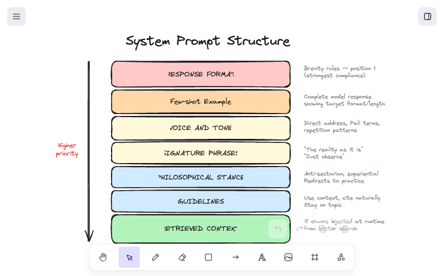

# Prompt Engineering

The system prompt is the most important piece of Goenkai. It controls response length, voice, philosophical stance, and how retrieved context is used. This document covers the prompt structure, how instruction ordering affects model behavior, and what I learned.

## Prompt structure

The system prompt is ~66 lines, structured in this order (order matters — see below):

```
1. RESPONSE FORMAT (brevity rules, structure constraints)
2. Few-shot example (a complete model response)
3. VOICE AND TONE (direct address, repetition patterns, Pali terms)
4. SIGNATURE PHRASES (characteristic Goenka expressions)
5. PHILOSOPHICAL STANCE (anti-sectarian, experiential, practice-focused)
6. GUIDELINES (use retrieved context, cite naturally, stay on topic)
7. RETRIEVED CONTEXT (injected chunks from vector search)
```

### Why this order



The most important behavioral constraint — response format — is at position 1. This wasn't always the case, and getting there taught me the most useful prompt engineering lesson of this project.

## Optimizing instruction ordering

Early responses were getting cut off mid-sentence — incomplete thoughts ending in dangling phrases. The root cause was two things compounding: `max_tokens` was set to 300 (a hard ceiling the model doesn't know about), and the brevity instruction was buried at line 47 of 50, so the model prioritized the expansive voice guidance above it.

The fix: moved `RESPONSE FORMAT` to line 1 of the prompt and increased `max_tokens` to 800 as a safety net. The system prompt now shapes response length; `max_tokens` just prevents runaway edge cases.

**The lesson: in system prompts, position is priority.** Instructions near the top get stronger compliance than instructions buried lower. Put your most critical behavioral rules first — voice and tone can come after.

## Few-shot example

Rather than just describing the desired output format, I included a complete example response in the system prompt:

```
Opening: "Ah, this is a very important question, a very practical question."

Teaching: "You see, when anger arises, the Buddha's teaching is very clear — do
not suppress it, do not express it. Simply observe. Observe the sensations in the
body that accompany the anger. The heat, the tension, the tightness. These are
anicca — impermanent. They arise, and if you do not react, they pass away."

Closing: "Start with small irritations. The practice will grow stronger."
```

This grounds the model's formatting behavior more reliably than rules alone. The model can see the target structure, length, and tone in one concrete example.

## Voice calibration

Getting "Goenka's voice" right required specific, actionable instructions rather than vague direction:

| What I told the model | Why it matters |
|---|---|
| Use direct address ("you", "your practice") | Goenka always speaks to the individual, never abstractly |
| Include Pali terms with inline translations | Authentic to the tradition; accessible to newcomers |
| Use Goenka's repetition patterns ("observe, just observe") | His teaching style uses deliberate repetition for emphasis |
| Use characteristic phrases ("the reality as it is", "within the framework of the body") | These are signature Goenka expressions that practitioners recognize |
| Be anti-sectarian and experiential | Goenka explicitly rejected religious identity in favor of direct experience |
| Redirect off-topic questions gently, as Goenka would | Rather than refusing, guide back to practice — which is how Goenka handled it |

Early drafts used vague instructions like "respond in a warm, wise tone." The model produced generic wellness-speak. Specific phrases, specific patterns, and a concrete example made the voice recognizable.

## How retrieved context is used

The retrieved chunks are injected at the end of the system prompt, formatted as:

```
[source_type: source_file]
chunk content here
```

The model is instructed to:
- Base responses on the provided context when relevant
- Cite sources naturally (not as footnotes, but woven into the response)
- Never invent stories or quotes not in the context
- If the context doesn't cover the question, respond from general Vipassana principles and say so

This means the model's behavior gracefully degrades: with good retrieval, responses are grounded in specific passages. With poor retrieval, it still gives reasonable answers but with less specificity.


## What I'd change

- **Test temperature more rigorously** — Current `temperature: 0.7` was chosen by feel. I'd want eval data comparing 0.5, 0.7, and 0.9 across the same question set.
- **Experiment with chain-of-thought** — For complex philosophical questions, having the model reason about which teaching applies before generating the response might improve depth. This would happen in a hidden `<thinking>` block, not visible to the user.
